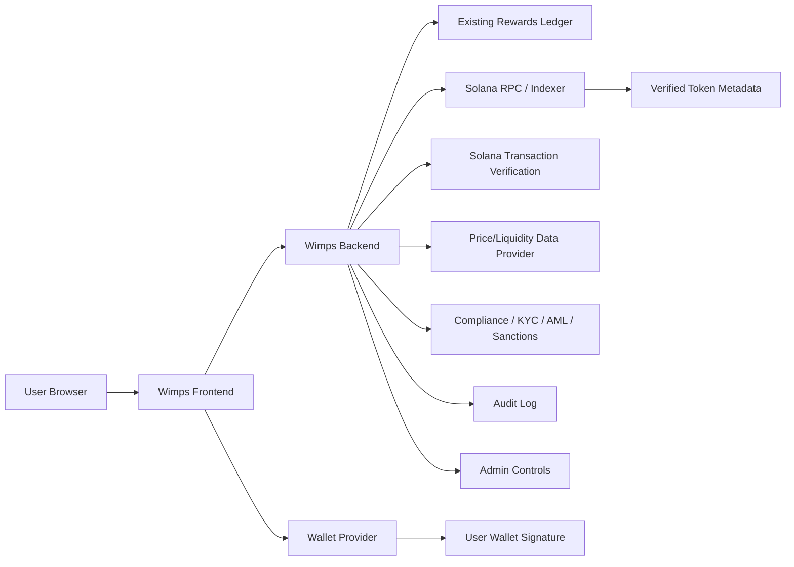

# WIMP Solana Integration Discovery and Architecture Report

Status: discovery complete, no production code modified.

This report is a pre-implementation architecture and approval document. It treats the existing WIMP Rewards Points system and the real Solana token as separate systems and intentionally keeps the blockchain layer disabled until explicit approval.

## 1) Current technology stack

- Frontend framework and version: static HTML/CSS/vanilla JavaScript; no framework package manifest or app build tool was found in the frontend directory. The frontend is implemented as server-rendered/static pages under [wimps](../wimps) and does not currently use React, Vue, Angular, or similar.
- Backend framework and version: Node.js + Express 5.2.1, as shown in [wimps-back/package.json](package.json) and [wimps-back/server.js](server.js).
- Programming language: JavaScript (Node.js runtime).
- Database engine: MongoDB, with a runtime fallback to MongoDB Memory Server when no configured `MONGODB_URI` is present.
- ORM / database layer: Mongoose 9.6.0, plus file-backed JSON fallback data for development and degraded-mode operation via [wimps-back/utils/fileDb.js](utils/fileDb.js), [wimps-back/utils/localStore.js](utils/localStore.js), and [wimps-back/utils/wimpStore.js](utils/wimpStore.js).
- Authentication system: custom signed JWT-like bearer token mechanism using `Authorization: Bearer <token>`, implemented in [wimps-back/utils/auth.js](utils/auth.js). Token creation uses `AUTH_TOKEN_SECRET` or fallback to `ADMIN_API_TOKEN` as the signing secret.
- Authorization system: bearer-token validation for users and a shared admin token check (`X-Admin-Token`) for admin routes. There is no role model beyond the admin token and per-route access checks.
- User roles: user accounts exist in [wimps-back/models/user.js](models/user.js), but there is no structured RBAC role table.
- Admin roles: administrative access is currently a single shared admin token pattern, not an RBAC system. See [wimps-back/routes/admin.js](routes/admin.js) and [wimps-back/routes/adminWimp.js](routes/adminWimp.js).
- Existing WIMP Rewards Points tables: `WimpWallet`, `WimpLedger`, and `WimpSetting`, implemented in [wimps-back/models/WimpWallet.js](models/WimpWallet.js), [wimps-back/models/WimpLedger.js](models/WimpLedger.js), and [wimps-back/models/WimpSetting.js](models/WimpSetting.js).
- Existing rewards balance tables: same as `WimpWallet` and fallback JSON files `wimp-wallets.json`, `wimp-ledger.json`, `wimp-settings.json` under [wimps-back/data](data).
- Existing rewards transaction history: `WimpLedger` entries with `type` values including `earn`, `spend`, `refund`, `expiry`, and `admin_adjustment`.
- Existing payment-provider integrations: Paystack webhook support in [wimps-back/routes/payments.js](routes/payments.js), ResellerXpress integration in [wimps-back/services/resellerxpress.js](services/resellerxpress.js), Remadata in [wimps-back/services/remadata.js](services/remadata.js), Datamart provider logic in [wimps-back/services/datamart.js](services/datamart.js), and SendComms/SMS provider support in [wimps-back/services/sendcomms.js](services/sendcomms.js).
- Existing webhook handlers: Paystack webhook endpoint in [wimps-back/routes/payments.js](routes/payments.js); duplicate protection is implemented through [wimps-back/models/WebhookEvent.js](models/WebhookEvent.js).
- Existing background jobs and workers: automatic completion sweep in [wimps-back/services/autoComplete.js](services/autoComplete.js), started by [wimps-back/server.js](server.js) via `startAutoCompleteJob(app)`.
- Existing API conventions: REST endpoints under `/api`, bearer-auth for user routes, `X-Admin-Token` for admin routes, and `Idempotency-Key` usage for WIMP redemption and admin adjustments.
- Existing testing framework: Node.js built-in test runner (`node --test`) with tests under [wimps-back/test](test).
- Existing logging and monitoring: console logging is used; no centralized observability platform or structured log sink was identified in the repo.
- Existing deployment platform: no deployment manifest or infrastructure-as-code was found in the repo; deployment is effectively Node.js application hosting with MongoDB or in-memory fallback. This is unresolved without the owning deployment environment.
- Existing environment-variable conventions: `.env.example` contains `MONGODB_URI`, `ADMIN_API_TOKEN`, `AUTH_TOKEN_SECRET`, provider keys, and fee settings. See [wimps-back/.env.example](.env.example). The actual environment file exists but was not used to print secrets.
- Existing secrets-management approach: environment variables are used for provider and auth secrets; no dedicated secret manager or Vault/KMS pattern was identified. This is unresolved beyond the local `.env` pattern.
- Existing security controls: basic token validation, timing-safe comparison, CORS, JSON-body limits, webhook signature validation for Paystack, and duplicated webhook prevention for `WebhookEvent`.
- Existing rate-limiting controls: no explicit global rate-limiting middleware or token-bucket control was identified. This is unresolved or not present.
- Existing data-retention behavior: there is no explicit retention policy in the codebase. Some admin endpoints can purge transaction history with a confirmation message, as seen in [wimps-back/routes/admin.js](routes/admin.js).
- Existing account-deletion behavior: there is a customer deletion endpoint in [wimps-back/routes/admin.js](routes/admin.js). No self-service account deletion flow was identified.
- Existing audit-log functionality: there is no dedicated append-only tamper-evident audit table or admin action log. The closest analog is `WebhookEvent` deduplication plus ledger entries recording `createdBy`. This is not a full audit framework.
- Existing notification system: email notifications via Resend in [wimps-back/services/resend.js](services/resend.js). Password reset and customer email flows exist.
- Existing error-reporting system: console error logging plus route-level error responses; no centralized error-reporting service was identified in the backend code.

## 2) Current rewards-system architecture

The current rewards engine is intentionally a separate internal ledger and should remain unchanged.

- Users have an internal `User` record with `balance` and referral values in [wimps-back/models/user.js](models/user.js).
- The active WIMP Rewards system stores wallet balances in `WimpWallet` and ledger entries in `WimpLedger`.
- Rewards are granted on completed purchase via `awardCompletedPurchase()` and can be reversed via `reverseCompletedPurchaseReward()` in [wimps-back/services/wimp.js](services/wimp.js).
- Rewards are spent through `spendWallet()` when redemption is processed through the product purchase flow in [wimps-back/routes/wimp.js](routes/wimp.js).
- Admin adjustments are possible through `adjustWallet()` with reason and idempotency key in [wimps-back/routes/adminWimp.js](routes/adminWimp.js).
- All reward ledger entries are immutable in spirit: new records are added, balances are recalculated, and duplicates are rejected by idempotency keys.
- The current README explicitly states WIMP Rewards are promotional points, not cryptocurrency, not Ghanaian cedi, and not transferable cash. See [wimps-back/README.md](README.md).

This means the existing rewards stack is effectively a loyalty ledger, not a blockchain wallet or token balance system.

## 3) Current database schema relevant to rewards and users

### Users

- `users` collection via Mongoose model `User` in [wimps-back/models/user.js](models/user.js)
- Fields include `fullname`, `email`, `password`, `balance`, referral metadata, and reset token fields.

### Rewards ledger

- `wimp_wallets` collection via `WimpWallet` in [wimps-back/models/WimpWallet.js](models/WimpWallet.js)
- `userId`, `balanceUnits`, `version`, timestamps
- `balanceUnits` is stored as integer hundredths (`100` = `1.00 WIMP`), matching the project’s documented reward units.

- `wimp_ledger` collection via `WimpLedger` in [wimps-back/models/WimpLedger.js](models/WimpLedger.js)
- Fields: `userId`, `walletId`, `type`, `amountUnits`, `balanceBeforeUnits`, `balanceAfterUnits`, `referenceId`, `description`, `createdBy`, `idempotencyKey`, `createdAt`

### Settings

- `wimp_settings` collection via `WimpSetting` in [wimps-back/models/WimpSetting.js](models/WimpSetting.js)
- Key/value settings such as `rewardPerCompletedPurchaseUnits`, `redemptionEnabled`, `minimumRedemptionUnits`, `maximumDiscountUnits`, etc.

### Transactions

- `transactions` collection via `Transaction` in [wimps-back/models/Transaction.js](models/Transaction.js)
- This tracks purchase and provider-related order activity, not blockchain token transfers.

### Fallback files

- JSON fallback data is stored under [wimps-back/data](data) when MongoDB is unavailable.
- Important files: `users.json`, `transactions.json`, `wimp-wallets.json`, `wimp-ledger.json`, `wimp-settings.json`.

## 4) Current authentication and authorization architecture

- User authentication is a custom bearer-token scheme; see [wimps-back/utils/auth.js](utils/auth.js).
- The server verifies the token signature and expiry, then ensures the user still exists before allowing the route.
- Users are not assigned roles in the schema; they are simply authenticated users.
- Admin access relies on a single static `X-Admin-Token` header value, not user-based RBAC.
- This is a minimal auth model and does not currently satisfy a production-grade blockchain admin access model.

## 5) Proposed WIMP token architecture

The future WIMP blockchain token must be architected as a distinct system from the existing internal WIMP Rewards Points ledger.

### Principle

- `WIMP Rewards Points`: internal loyalty ledger only
- `WIMP token`: real Solana token identified by verified mint address only
- The blockchain token must not replace or absorb rewards history
- Conversion must remain opt-in and disabled by default

### Proposed components

- `solana_token_config`: verified mint metadata and feature flags
- `wallet_connections`: user wallet linkage records
- `wallet_nonces`: one-time wallet ownership verification challenge data
- `blockchain_transactions`: canonical on-chain transaction records
- `token_transfers`: token transfer activity for user wallets
- `token_balance_snapshots`: periodic or event-driven balance snapshots
- `token_conversions`: opt-in rewards-to-token conversion events if later approved
- `price_observations`: externally sourced market price data with age and confidence markers
- `liquidity_observations`: venue liquidity and slippage metadata
- `audit_events`: append-only tamper-evident admin action log
- `indexer_cursors`: blockchain indexing progress cursor
- `feature_flags`: independent toggles for wallet, send, receive, price display, conversion, trading, etc.

## 6) Proposed Solana integration architecture

- Solana cluster and network must be configured explicitly, with no mixing of testnet and mainnet settings.
- Server-side configuration will include:
  - cluster/network
  - RPC provider and WebSocket provider if applicable
  - indexing provider
  - verified mint address
  - token program and decimals
  - supply metadata and transfer authorities
  - feature flags and emergency pause
- A server-side validator will verify the configured mint against Solana RPC at application startup and deployment.
- The system will rely on external wallet standards compatible with Solana wallets such as Phantom, with non-custodial signing only.
- The site will never request private keys or seed phrases.

## 7) Wallet and custody model

Recommended model: non-custodial wallet integration only.

- Users connect a Solana wallet using a standard browser wallet provider.
- The website stores only minimal wallet association metadata needed for the user session.
- The backend verifies wallet ownership with a nonce challenge and signature verification.
- Wimps will never hold customer private keys in frontend code, source control, logs, ordinary environment variables, or the database.
- The backend must never sign user transactions on behalf of users.

## 8) External-wallet interoperability plan

- Support standard Solana wallet connection using approved wallet providers.
- Provide wallet connect, disconnect, replace, address display, network display, verified mint display, and copy-address controls.
- Maintain a server-generated nonce with expiration, replay protection, and one-time use.
- Require independent verification of wallet ownership before enabling token actions.
- Expose user wallet address, connected network, and verified mint address only after wallet verification.

## 9) Buy and sell integration plan

This must remain disabled until an approved integration is verified.

- Initial state: buying and selling are disabled by default.
- If pump.fun is considered, the system must verify whether the official integration method exists, whether API or embedded trading is allowed, whether it is server-side supported, and whether the integration is approved by the owner and compliance team.
- If no approved pump.fun integration exists, provide an external verified link instead of claiming platform-integrated trading.
- Any buy/sell flow must include quote, slippage, network fee, liquidity warning, market-risk warning, and irreversibility language.
- No fake volume, no fake liquidity, no wash trading, and no price manipulation.

## 10) Price and liquidity plan

- Use only approved and verifiable market-data sources.
- Price display must include source, pair, price, timestamp, age, and confidence status.
- Price data must be rejected if stale, missing, conflicting, unsupported, or based on insufficient liquidity.
- Display values must be labeled as estimated market value only and not guaranteed cash value.
- The system must never promise appreciation, guaranteed liquidity, or guaranteed resale.
- Only exact integer base units and exact decimal arithmetic may be used for prices, limits, fees, and slippage calculations.

## 11) Compliance-control plan

- Country restrictions, age checks, KYC, AML, and sanctions controls must be implemented as feature-specific restrictions, not only user-level checks.
- A user may be allowed to view a balance but not convert, buy, sell, or cash out.
- Country, age, and KYC provider configuration must be separated from the internal points system.
- cash-out and trading must remain fully disabled until legal and operational review is complete.

## 12) Data-flow diagram

## 13) Database migration plan

- Keep the existing rewards tables and records untouched.
- Add new blockchain tables and indexes in a separate migration phase.
- Use new collection names or schema namespaces rather than altering `WimpWallet` or `WimpLedger` semantics.
- Add unique constraints for transaction signatures, idempotency keys, conversion references, and wallet linkage tokens.
- Use explicit migration scripts and rollback procedures with database backups.
- Keep blockchain tables isolated from reward ledger logic.

## 14) API plan

Proposed API groups:

- Wallet verification: nonce creation, wallet ownership verification, wallet disconnect
- Blockchain config: token configuration, feature flags, balance display status
- Token activity: balance lookup, transaction listing, transfer status
- Market data: price lookup, liquidity lookup
- Conversion: conversion quote, conversion creation, conversion status
- Trading: quote, trade intent, trade status
- Admin: configuration, approvals, audit logs, refunds or emergency controls

Every financial API must include:

- auth + authz
- validation
- rate limiting
- idempotency key handling
- regulatory/compliance checks
- emergency-pause checks
- server-side verification independent of browser claims
- safe error handling

## 15) Security-risk register

- Mint-address spoofing or incorrect network configuration
- Browser-reported balances being trusted without server verification
- Wallet signature replay attacks
- Duplicate financial processing without idempotency keys
- Unsafe storage of provider secrets or blockchain credentials
- Stale or manipulated price feeds
- Unapproved pump.fun trading claims
- Insufficient audit logs for high-risk admin actions
- Missing rate limiting and abuse detection
- Public mainnet activation before compliance review

## 16) Admin-control plan

Admin controls must be reworked into secure, explicit RBAC and approval workflows.

Recommended phased controls:

- Approve WIMP mint address
- Approve feature flags and emergency pause states
- Review token metadata, authorities, and supply
- Review price-source configuration
- Enable or disable wallet features individually
- Maintain approval logs for high-risk changes
- Require multiple-person approval for mainnet trading, cash-out, treasury changes, and fee changes

## 17) Testing plan

1. Unit tests for wallet nonce validation, token config validation, and feature-flag gating.
2. Integration tests for Solana RPC reads and token account parsing.
3. Security tests for nonce replay protection and signature verification.
4. Reconciliation tests for indexer resumes, duplicate transactions, and missed logs.
5. Rewards-preservation tests to ensure no existing WIMP Rewards data is rewritten or reinterpreted.
6. Price freshness and liquidity validation tests.
7. Emergency pause tests and rollback tests.
8. Devnet or controlled test environment validation before mainnet activation.

## 18) Deployment plan

- Phase 1: architecture approval
- Phase 2: schema design approval for blockchain tables
- Phase 3: devnet or controlled environment validation
- Phase 4: security/compliance review
- Phase 5: private mainnet or limited testing with manual approval
- Phase 6: production activation only after explicit sign-off

No public mainnet functionality should be enabled automatically after deployment.

## 19) Rollback plan

- Disable wallet connections, transfers, conversion, buying, selling, and cash-out via feature flags.
- Hide stale prices.
- Freeze conversion processing and prevent new trade intents.
- Continue read-only blockchain reconciliation without altering balances.
- Preserve existing WIMP Rewards history and audit logs.
- Restore verified backups if needed.
- Reconcile blockchain status after recovery.
- Document the incident and escalate to a controlled corrective action.

## 20) Files that would be changed

This is a future-state list, not an applied patch:

- [wimps-back/models](models) — add Solana token config and wallet/indexing models
- [wimps-back/routes](routes) — add wallet, blockchain, price, conversion, and admin Solana endpoints
- [wimps-back/services](services) — add Solana RPC/indexer, price feeds, compliance checks, and feature-flag logic
- [wimps-back/utils](utils) — add validation helpers, idempotency handling, and server-side verification utilities
- [wimps-back/server.js](server.js) — register Solana routes and startup validation
- [wimps-back/test](test) — add Solana integration, security, and rewards-preservation tests
- [wimps-back/.env.example](.env.example) — add Solana config placeholders and feature flags

## 21) Missing information required from the owner

The following items are required before a production-ready design can be approved:

- Verified WIMP mint address on Solana
- Solana cluster target (devnet, mainnet, or another network)
- Official pump.fun integration status and approved method, if any
- Approved price source(s) and liquidity source(s)
- Approved wallet list and wallet compatibility standard
- Supported countries and blocked countries
- KYC/AML provider selection
- Sanctions screening provider
- Treasury wallet addresses and multisig plan
- Mainnet activation approval path
- Legal/compliance sign-off for utility payments, conversion, trading, and cash-out
- Whether users must be able to hold WIMP outside Wimps
- Whether the ownership of WIMP token should be display-only or enabling transfers and trading

## 22) Third-party services required

- Solana RPC provider
- Solana indexing provider or transaction stream
- Approved Solana wallet provider integration
- Approved price feed or market-data provider
- Approved liquidity or trading venue if buy/sell is enabled
- Payment-provider integration for any cash-out or utility purchase path
- KYC provider
- AML and sanctions screening provider
- Email or notification provider if user communications are needed

## 23) Assumptions requiring approval

- Non-custodial wallet model remains required unless a custodial design is explicitly approved.
- WIMP Rewards Points remain unchanged and separate.
- No automatic conversion from rewards points to blockchain tokens is approved.
- No public mainnet buy/sell/cash-out flow is approved until manual review.
- Token trading remains a separate feature from the internal reward program.
- Pump.fun integration must be verified before any trading claims are made.

## 24) Recommended decision gate

The successful approval gate is:

1. Confirm the real WIMP mint address and Solana configuration
2. Confirm the exact wallet and network strategy
3. Confirm the legal/compliance posture for feature activation
4. Confirm whether the project wants only display + transfer support, or also conversion/trading/cash-out
5. Approve feature flags and emergency controls before any mainnet enablement

Until those decisions are approved, all blockchain features should remain disabled and non-public.

## Summary

The codebase currently contains a self-contained WIMP Rewards Points system that is separate from blockchain activity. It stores rewards via `WimpWallet` and `WimpLedger`, exposes admin and user endpoints for wallet operations, and uses idempotency keys to prevent duplicate ledger adjustments. There is no current implementation for a real Solana token wallet connection, blockchain indexing, token transfers, or market-data verification.

The correct architecture is to add a strictly isolated Solana token system with server-side verification, feature flags, and explicit admin approval gates. It must never replace or reinterpret the existing WIMP Rewards Points system.
